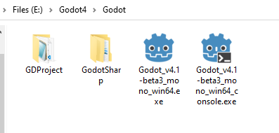
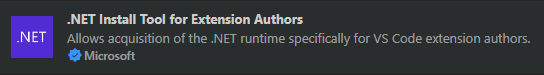
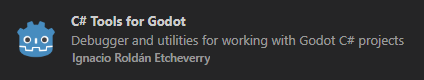
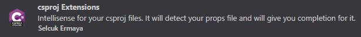
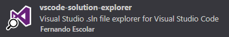
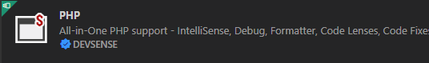
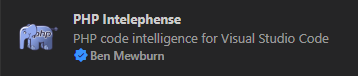
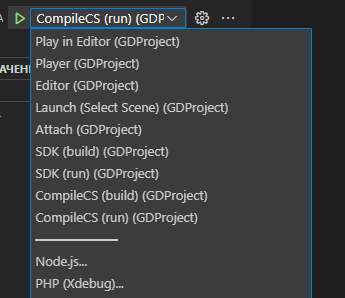

### Установка и настройка
---
* [скачать](https://dotnet.microsoft.com/en-us/download/dotnet/7.0) и установить .NET Core 7
* [скачать](https://downloads.tuxfamily.org/godotengine/4.1/) последнюю версию редактора Godot 4 (```на момент написания версия 4.1-beta```) 
* распаковать в любую директорию 
* выполнить клонирование проекта (как указано ниже)<br>
```
git clone https://github.com/N0zzy/GodotPeachpieProject.git
``` 
>  <br>
> при желании можете переименовать директорию в `GDProject`

<br>

### VSCode
---
* установить [VSCode](https://code.visualstudio.com/) 
* установить плагины для VSCode
     - ***.NET Install Tool for Extension Authors***<br>
      
     - ***.C# Tools for Godot***.<br>
      
     - ***.csproj Extensions | VS Code .csproj***. <br>
      <br>
      
     - ***.vscode-solution-explorer***.<br>
      
     - ***.PHP | PHP Intelephense***.<br>
       <br>
       
     - любые расширения Nuget, с которыми вам будет удобно работать

<br>

### VSCode (дополнительные настройки)
---
* в файле `GDProject.code-workspace` найдите и проверьте опцию<br> 
``` 
"omnisharp.sdkPath": "/Program Files/dotnet/sdk/7.0.304"
```
`если ее не будет, добавь согласно примеру`
* откройте файл 
```
/.vscode/launch.json
```
> найдите опцию `"executable": "../название_приложения.exe"`. измените значения под ваш текущий проект...
* откройте файл 
```
/.vscode/tasks.json
```` 
> найдите опцию `"command": "../название_приложения.exe"`. измените значения под ваш текущий проект...

<br>  

### VSCode (запуск проекта и debug)

 

если установка всех необходимых расширений выпонена правильно, в том числе настройка, то редактор предоставит на выбор несколько вариантов запуска приложений и утилит

<br>  

### Утилиты (тестовые версии)
---
в проект добавлены утилиты:
```
/Utils/GodotCompile
```
```
/Utils/SharpieSdk
```

<br>  

### GodotCompile
---

* [git clone https://github.com/N0zzy/GodotCompile](https://github.com/N0zzy/GodotCompile.git) 

компилирует некоторые php-скрипты в `пустышки` для Godot.
`пустышки` - выполняю роль имплементации кода php в проект Godot
для их создания необходимо использовать:
* комментаций 
```
/**
 * @compile-cs
 */
```
* префикс `Ux`
```
UxMyClass
```
* `abstract class` для `override` методов, таких как `_Ready()` и другие

<br>

>пример:
```php
/**
 * @compile-cs
 */
class UxMyClass extends UxMyClassAbstract {

}
```
* файл настроек ``compile.json``
```json
{
  "prefix": "Ux",
  "path": {
    "input": "E:\\Godot4\\Godot\\GDProject\\GDLibrary",
    "output": "E:\\Godot4\\Godot\\GDProject\\GDApplication"
  }
}
```

<br>  

### SharpieSdk
---

* [git clone https://github.com/N0zzy/SharpieSdk.git](https://github.com/N0zzy/SharpieSdk) 

данная утилита создать папку `.sdk` для зависимостей из `CSharp` библиотек.
`.sdk` использовать только для *``чтения``*

* файл `.sdkpath` - хранит абсолютный путь до места распаковки (либо текущий диск)
* файл `.sdkignore` - хранит `assembly .NET` чтобы игнорировать при распаковке sdk (ускоряет процесс анализа)

